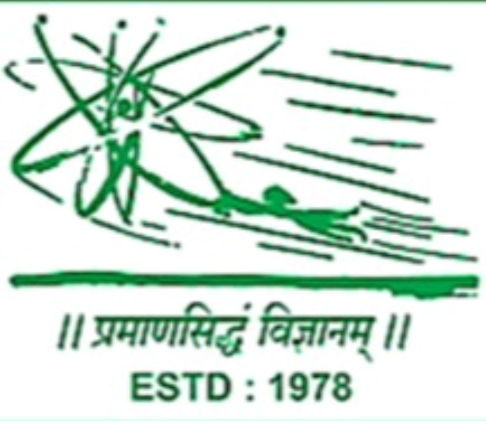

# Science Forum Nashik

An informal body in the name of “Science Forum Nashik” has been acting since 1978 and conducting various programs, (like lectures by scientists, Hobby Classes during vacation of school children, workshops for teachers and competitions making video clips showing activity-based learning activities for school children) for advancement of the cause of developing scientific temper, creating awareness and developing interest in the young minds and in the public in general, a need for registering the body under Association of Persons was realised by the members of the above-mentioned informal body to address to the various legal, financial and administrative issues. Therefore, an Association of Persons (hereinafter called “the AOP”) in the name “Science Forum Nashik”  was formed comprising of eleven of the members of the above-mentioned informal with a view of adding more persons interested in the causes being espoused by the body and with provision that the members not interested due to any reasons may opt out of the body. 

## Our Objectives (Section 2 of Deed)

(2.1) to assist in inculcation of the spirit of scientific temper in the minds of general population, particularly the young persons, by asking relevant questions and seeking answer to these questions through methods of science including experiments, building theories which explain these experiments in qualitative and quantitative manners and make such predictions which are falsifiable and not to subscribe to dogmatic, superstitious explanations;
  
(2.2) to develop interests in science content;  
(2.3) to facilitate discussions on the current developments in the field of science, technology and their impacts on the lives of general population;
 
(2.4) to facilitate development of curiosity in the minds of populations so that they question the phenomena and seek to find answer through study of science content in an enjoyable manner and thereby propagate spirit of joyful learning to others;
 
(2.5) to assist the general population including the young minds to develop methods which will enable them to solve the problems (falling under the domain of science and technology) including those involving their daily life issues in a systematic, creative (including out-of-the-box thinking) and ecologically self-sustaining manner;
  
(2.6) to make use of the technology including information and communication technology (ICT) to achieve its objectives in cost-effective, efficient and effective manners.

## List of Members
As of 01 Nov 2025 – see full Deed PDF below.

## Important Decisions – Form 9.1.B

**Meeting Date:** 28 October 2025 | 1930 Hrs | Hybrid  
**Prepared by:** Prof. Dr. Rajendra V Vadnere  
**Circulated:** 25 Oct 2025  

**Item No. 28102025/01:** To discuss proposal of approving various forms...  
[Proposal](https://docs.google.com/document/d/1uPBBtE7r-dxs6Fa68enzxCxcT8la/edit?usp=sharing&ouid=117018900723103727942&rtpof=true&sd=true) | 
[Draft Forms](https://docs.google.com/document/d/110cIvBQOHBC1HsfdKWSN3_HsdrwRnIC/edit?usp=sharing) | 
[Advantages of Hierarchical Numbering](https://docs.google.com/document/d/12Bev7ewdI5ymRTERXlhD7_XIcF6wFDlz/edit?usp=sharing) | 
[ChatGPT Review](https://docs.google.com/document/d/1yhhTEkrZNlcerHGaSPYPDW0trwJv_j/edit?usp=sharing)

**Item No. 28102025/02:** LG Mobile Laboratory, SPPU collaboration  
[Proposal](https://docs.google.com/document/d/188KAWzQF-lyzA8AaI2RWL_i5dxwVV9/edit?usp=sharing)

**Item No. 28102025/03:** Teacher Workshop for Hands-on Videos  
[Proposal](https://docs.google.com/document/d/1R0GXPFVc17Ml-Qg8lmIrE6YAKK4QkV/edit?usp=sharing)

**Full 4-Page Form 9.1.B PDF:**  
[Download/ View October 28 Meeting PDF](https://drive.google.com/file/d/1ZK5zA2C1DYTtx6EJECP_LD-GsDQdhCgZ/view?usp=sharing)

## Upcoming Events
- Video Clip Competition 2026 (Under Development)

## Past Events
- 28 Oct 2025: First Formal Hybrid Meeting

## Full AOP Deed
[Download Signed Deed (1 Sep 2025)](deed-signed.pdf) *(upload your PDF to repo root)*

## Caveat
Members are jointly and severally liable for AOP liabilities as per Section 1 of the Deed.

## Copyright
© 2025 Science Forum Nashik AOP. All rights reserved.  
